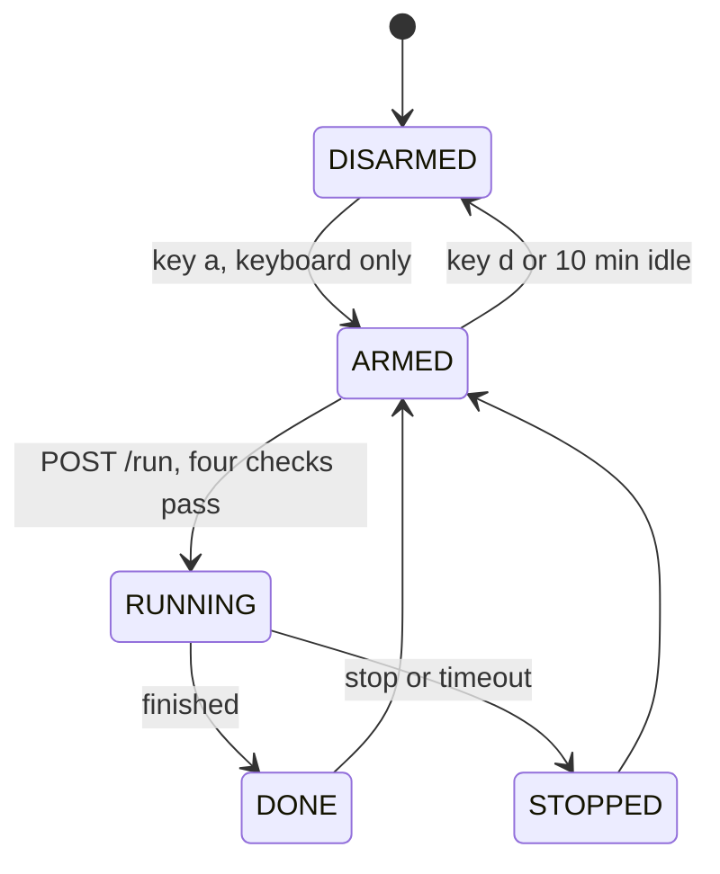

# jarvis

The brain side of the robot: the skill runner, the safety layer, the trial log and the scoreboard. Later, the Reachy Mini conversation profile and the tools the voice assistant can call.

The runner is the only process allowed to start a motion. It talks to LeRobot in `../arm` as a separate process and never imports it.

## How it works



Five diagrams with notes on what to learn from each: [docs/architecture.md](docs/architecture.md). Where the runner sits, the full state machine, the four checks before a run, the four stop paths, and how a trial becomes a score.

## Install

```bash
brew install uv
cd jarvis
uv venv --python 3.12 .venv
uv pip install --python .venv/bin/python -r requirements.lock
cp .env.example .env
```

## Run the skill runner

```bash
scripts/runner.sh
```

Keys in the runner window:

| Key | Does |
|---|---|
| `a` | arm. Only the keyboard can arm. There is no HTTP way, on purpose. |
| `d` | disarm |
| `s` or space | stop the current run |
| `p` | mark preflight as passed today |
| `e` | acknowledge the e-stop reminder for this session |
| `q` | quit (disarms first) |

The runner auto-disarms after 10 minutes with no run. Change with `--idle-timeout <seconds>`.

## HTTP API (127.0.0.1:8765)

| Call | Does |
|---|---|
| `GET /health` | liveness |
| `GET /state` | phase (DISARMED, ARMED, RUNNING, DONE, STOPPED, FAILED), current run, who stopped it |
| `GET /skills` | registered skills |
| `POST /arm` | always 403. Arming is keyboard only. |
| `POST /disarm` | disarm, stops a run if one is going |
| `POST /run {"skill": "mock"}` | start a skill. 409 with a reason when not allowed. |
| `POST /stop` | stop the run. Returns once the state is STOPPED, within 300 ms. |

A run only starts when all four hold: armed, preflight passed today, no other run in progress, e-stop reminder acknowledged. Every run has a hard timeout from its skill and writes one line to `logs/runs.log` and one row to `logs/trial-log.csv`.

Example:

```bash
curl -s -X POST localhost:8765/run -H 'Content-Type: application/json' -d '{"skill":"mock"}'
curl -s -X POST localhost:8765/stop
```

## Run a protocol trial

```bash
scripts/trial.py mock            # one trial, next position from config/positions-seed.txt
scripts/trial.py mock --dry-run  # prints every step, calls nothing, writes nothing
scripts/validate_log.py          # checks every row of logs/trial-log.csv
```

The runner must be up and armed (keys a, p, e). The script reads the skill card in `skills/`, says the trial id out loud, asks for the reset, counts down, starts the run, and waits. Press `s` or `f` and Enter to end early. It then asks the judge for the result, the fail category and a note, and appends one row. Judge name, sprint and layout come from `.env`.

## Scoreboard

```bash
scripts/scoreboard.py
```

Builds `SCOREBOARD.md` from `logs/trial-log.csv`. Same CSV gives the same file every time. Never edit the CSV rows by hand. Add a correction row instead.

## Skills

Only `mock` exists. It sleeps 5 seconds and moves nothing. Real skills come with a skill card in `skills/` and a policy trained in `../arm`.

## Known limits

- The keyboard reads whole lines, so press the key and then Enter.
- One runner at a time. It binds to 127.0.0.1 only.
- No voice, no Reachy, no real skill yet.
