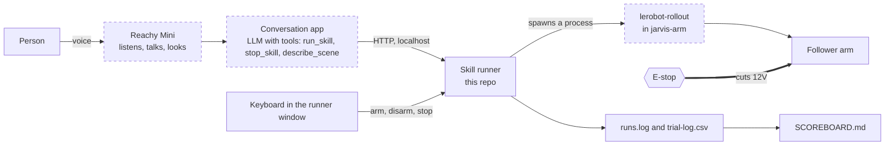
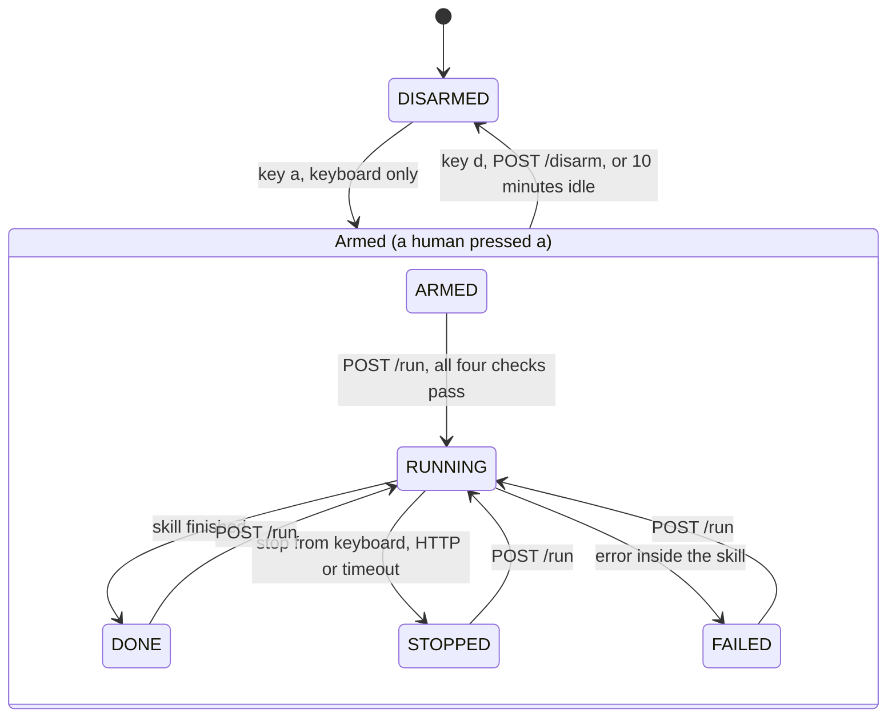
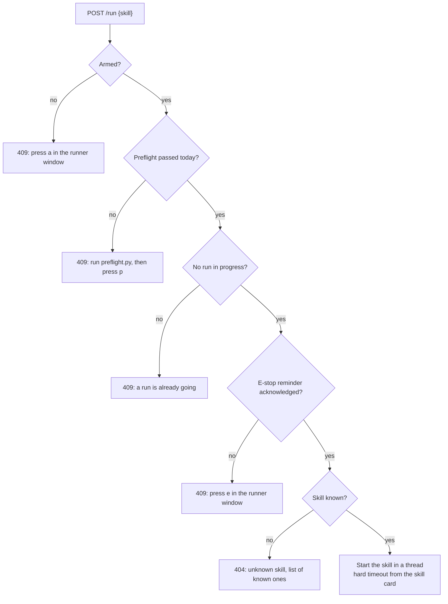
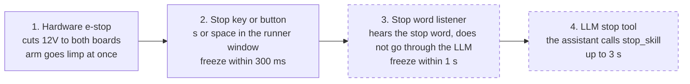
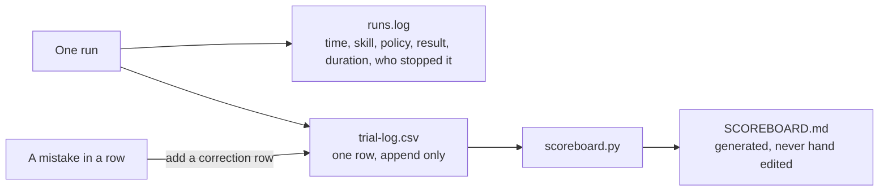

# How the brain works

Diagrams for people who want to learn from this build. They render on GitHub. To change one, edit the text block, there are no image files.

Dashed boxes are planned and not built yet. Solid boxes exist in this repo or in [jarvis-arm](https://github.com/Jarviswashere/jarvis-arm).

## 1. Where the runner sits

What to notice:

- The LLM never touches the arm. It can only ask the runner. The runner decides.
- The runner never imports LeRobot. It starts it as a separate process, so a crash in one does not take the other down, and the two can be updated on their own.
- The keyboard has powers the LLM does not have. That asymmetry is the whole safety design.

## 2. The runner state machine

What to notice:

- There is no HTTP way into the armed state. `POST /arm` always answers 403. That is a rule enforced by code, not by a comment.
- Idle time counts only while no run is going. A run in progress is never cut by the idle timer. It is cut by its own timeout.
- Disarming during a run stops the run first. Disarm is always safe to call.

## 3. Can this run start

Every `POST /run` passes four checks. The first one that fails is the answer, with a sentence that says what to do.

What to notice:

- 409 means "not now", 404 means "no such thing". A caller, human or LLM, can tell the two apart.
- Two of the checks are things only a person can set, by pressing a key after doing something in the real world.

## 4. Four ways to stop, fastest first

All four must work. Each one is tested at the start of every session and the latency is written down.

What to notice:

- The slowest path is the smartest one. The fastest path is a switch on a wire. Never make the smart path the only path.
- The stop key sets an event. The skill thread checks that event every 20 ms, so the measured stop time is a few tens of milliseconds.
- A stop counts as a failed trial in the log, with `stopped_by` filled in. Honest numbers include the stops.

## 5. From one trial to the scoreboard

What to notice:

- Rows are never edited. A wrong row gets a correction row after it. The history stays honest.
- The scoreboard is a pure function of the CSV. Run the generator twice and you get the same file. Anyone can regenerate it and check a number.
- A score is 20 trials on one day under one written protocol. Fewer trials, mixed days or a changed layout are not a score.
